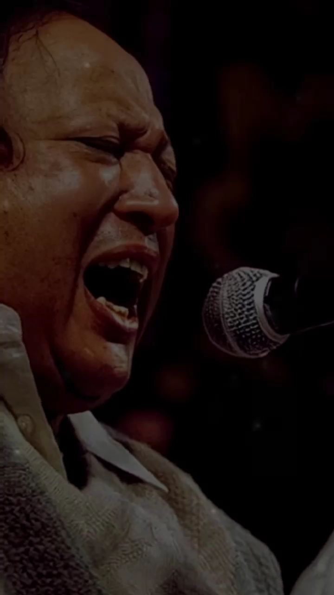

# 🎵 NFAK Mini Game - Qawwali Quiz

<div align="center">
  
  
  [](https://html.com/)
  [](https://www.w3.org/Style/CSS/)
  [](https://www.javascript.com/)
  [](https://sweetalert2.github.io/)
</div>

## 🌟 Overview

Test your knowledge of the legendary Qawwali maestro, Ustad Nusrat Fateh Ali Khan, with this interactive quiz game. Challenge yourself with famous Qawwali lines and compete with other fans on the leaderboard!

## ✨ Features

- 🎮 Interactive quiz with famous Qawwali lines
- ⏱️ 20-second timer for each question
- 📊 Real-time score tracking and statistics
- 🏆 Leaderboard to compete with other players
- 🎯 Achievement system
- 📱 Fully responsive design
- 🎵 Beautiful UI with Qawwali-inspired theme
- 📝 History tracking of your quiz attempts

## 🎯 How to Play

1. Enter your name to begin
2. Listen to the Qawwali line
3. Select the correct title from the options
4. Answer within 20 seconds
5. Earn points for correct answers
6. Maintain your streak for bonus points
7. Compete for the top spot on the leaderboard

## 📊 Game Statistics

- Total Score
- Correct Answers
- Accuracy Rate
- Current Streak
- Best Streak
- Questions Attempted
- Total Time Played
- Player Rank

## 🎨 UI Components

- Modern and responsive design
- Beautiful gradient backgrounds
- Smooth animations and transitions
- Intuitive navigation
- Mobile-friendly interface
- Custom popups and alerts

## 🛠️ Technologies Used

- HTML5
- CSS3
- JavaScript (ES6+)
- SweetAlert2 for beautiful popups
- Font Awesome for icons
- Google Fonts (Poppins)
- Local Storage for data persistence

## 🚀 Getting Started

1. Clone the repository:
   ```bash
   git clone https://github.com/MurShidM01/nfak-mini-game.git
   ```

2. Open `index.html` in your browser or use a local server:
   ```bash
   python -m http.server
   ```

3. Visit `http://localhost:8000` in your browser

## 📱 Browser Support

- Chrome (latest)
- Firefox (latest)
- Safari (latest)
- Edge (latest)
- Opera (latest)

## 🤝 Contributing

Contributions are welcome! Please feel free to submit a Pull Request.

## 📜 License

This project is licensed under the MIT License - see the [LICENSE](LICENSE) file for details.

## 🙏 Acknowledgments

- Ustad Nusrat Fateh Ali Khan for his timeless music
- All Qawwali enthusiasts and fans
- Contributors and supporters of this project

## 📞 Contact

For any queries or suggestions, please reach out to us.

---

<div align="center">
  Made with ❤️ By ALi Khan Jalbani
  </div> 